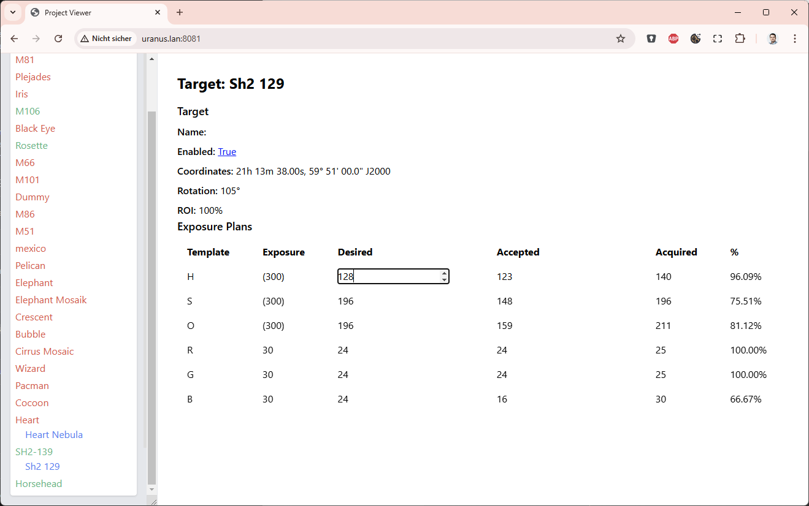

# NINA Target Scheduler Web

View and update Target Schedule plans for [NINA Scheduler](https://tcpalmer.github.io/nina-scheduler/).

## Features

- Toggle status of a project (active/inactive)
- Change the number of desired and accepted images for existing exposure plans



## Installation

1. **Install Python**: Download and install Python from [python.org](https://www.python.org/downloads).
2. **Open Terminal**: Start a terminal session.
3. **Navigate to Directory**: Change to your preferred directory, e.g., `cd \scripts`.
4. **Clone Repository**: Clone the repository using the following command:
   ```sh
   git clone https://github.com/photon1503/TSWeb.git
   ```

5. **Change Directory**: Navigate to the newly created directory:
   ```sh
   cd TSWeb
   ```

6. **Install Requirements**: Install the required packages:
   ```sh
   pip install -r requirements.txt
   ```
   If you encounter errors while building the astropy library, you may need to download the Visual Studio Build Tools or install astropy manually using:
   ```sh
   pip install astropy[recommended] --upgrade
   ```

## Running the Application
### Development Mode
To run the application in development mode, use the following command:
```sh
py tsweb.py
```
Then, open your browser and go to http://localhost:5000.

### Production Mode
To run the application in production mode, use the following command:
```sh
py tsweb_server.py
```
The port can be modified in tsweb_server.py. Open your browser and go to http://localhost:8081 or http://\<ip-of-your-observatory-pc\>:8081.

## Known Issues
- No support for multiple profiles