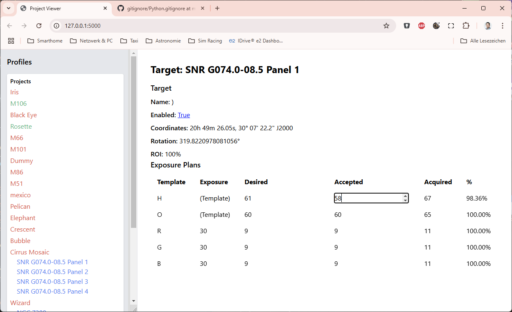

# NINA Target Scheduler Web

View and update Target Schedule plans.

Currently implemented:
* Toggle status of a project (active / inactive)
* Change desired and accepted images for exposure plans



# Install

```pip install -r requirements.txt```

# Run

## Development mode
```py tsweb.py```
Go to http://localhost:5000

## Production mode
```py tsweb_serve.py```
The port can be modified in tsweb_serve
Go to http://localhost:8081

# Known issues

* Different profiles can't be selected